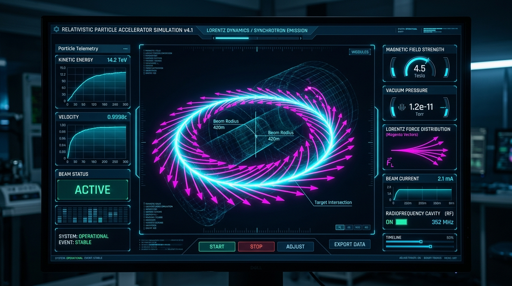
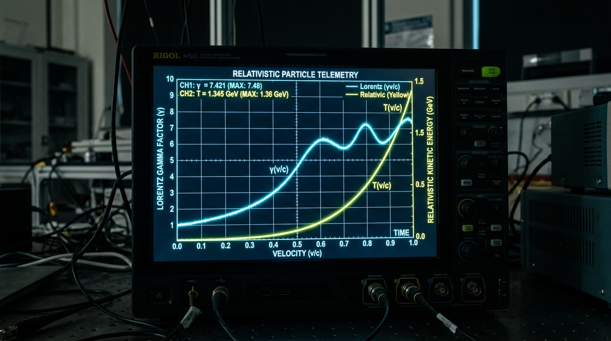

# RelativisticLab: High-Precision Relativistic Electrodynamics & Real-Time Telemetry Engine

[](https://developer.android.com)
[](https://kotlinlang.org)
[-emerald.svg)](#mathematical-foundations--numerical-methods)
[](#technical-stack--professional-libraries-used)
[](https://github.com/EthYusuf/lorentz-lab/releases/download/v.1.0.0/RelativisticLab.apk)
[](LICENSE)

> 📲 **Direct Download:** You can install the pre-compiled standalone application directly from our releases: **[Download RelativisticLab.apk](https://github.com/EthYusuf/lorentz-lab/releases/download/v.1.0.0/RelativisticLab.apk)**

---

## 1. Abstract

Modern experimental particle physics and accelerator design demand both rigorous numerical precision and low-latency graphical telemetry. **RelativisticLab** is a data-dense, mobile-native computational physics laboratory for exploring relativistic charged-particle dynamics in electromagnetic fields.

By coupling a multi-stage **4th-Order Runge-Kutta (RK-4) numerical integrator** directly with a hardware-accelerated **Jetpack Compose Canvas** and non-blocking asynchronous state pipelines (Kotlin Coroutines + `StateFlow`), the platform delivers both scientific rigor and real-time interactivity on commodity Android hardware.

The platform provides researchers, educators, and students with an interactive digital particle accelerator workstation—bridging the gap between desktop computational tools (such as CERN's ROOT framework) and mobile experiential learning.

---

## 2. Core Scientific Visualizations

The application incorporates a scientific laboratory design language characterized by high-contrast obsidian backgrounds (`#060A14`), neon spectral traces, and vector field overlays.

### Visualization Highlights

<p align="center">
  
</p>

> **Figure 1 — Relativistic Cyclotron Orbital Dynamics & Synchrotron Deflection**  
> *Analytical Detail:* Demonstrates a high-energy electron ($\beta = 0.85$, $\gamma = 1.898$) traversing a uniform transverse magnetic dipole field ($B_z = 0.05\,\text{T}$). The custom canvas dynamically renders the helical trajectory, Lorentz force vectors, and instantaneous power dissipation.

<p align="center">
  
</p>

> **Figure 2 — Real-Time Multi-Channel Oscilloscope & Telemetry Strip**  
> *Analytical Detail:* High-frequency rolling window telemetry module displaying real-time Lorentz factor $\gamma(t)$, relativistic speed $\beta(t) = v/c$, kinetic energy $E_k(t)$, and instantaneous power.

```
+-------------------------------------------------------------------------+
| [PLACEHOLDER: SCREENSHOT 3]                                            |
| docs/images/screenshot_wien_filter_zero_deflection.png                  |
+-------------------------------------------------------------------------+
```
> **Figure 3 — Wien Velocity Filter (Orthogonal $\vec{E} \perp \vec{B}$ Fields)**  
> *Analytical Detail:* Simulates the equilibrium velocity selector where collinear electric force $\vec{F}_E = q\vec{E}$ and magnetic deflection $\vec{F}_B = q(\vec{v} \times \vec{B})$ cancel exactly at the design speed.

```
+-------------------------------------------------------------------------+
| [PLACEHOLDER: SCREENSHOT 4]                                            |
| docs/images/screenshot_magnetic_mirror_reflection.png                   |
+-------------------------------------------------------------------------+
```
> **Figure 4 — Magnetic Mirror Confinement & Adiabatic Invariant $\mu$**  
> *Analytical Detail:* Visualizes charged plasma particle entrapment within a non-homogeneous magnetic bottle. Radial gradient field lines illustrate the transfer of longitudinal momentum $p_\parallel$ into transverse gyration energy.

---

## 3. Mathematical Foundations & Numerical Methods

### 3.1 Relativistic Equations of Motion

In relativistic mechanics, Newton's second law is generalized through the rate of change of relativistic four-momentum $\mathbf{p}$:

$$\frac{d\vec{p}}{dt} = \vec{F}_L = q \left( \vec{E}(\vec{r}, t) + \vec{v} \times \vec{B}(\vec{r}, t) \right)$$

where the relativistic momentum $\vec{p}$ is defined as:

$$\vec{p} = \gamma m_0 \vec{v}, \quad \gamma = \frac{1}{\sqrt{1 - \frac{|\vec{v}|^2}{c^2}}}$$

In numerical simulations, velocity $\vec{v}$ must be recovered inversely from the evolved momentum $\vec{p}$:

$$\vec{v}(\vec{p}) = \frac{\vec{p}}{\sqrt{m_0^2 + \frac{|\vec{p}|^2}{c^2}}}$$

The Lorentz factor $\gamma$ is computed identically as an invariant function of momentum:

$$\gamma(\vec{p}) = \sqrt{1 + \left( \frac{|\vec{p}|}{m_0 c} \right)^2}$$

The total relativistic energy $E$ and kinetic energy $E_k$ satisfy:

$$E^2 = (|\vec{p}| c)^2 + (m_0 c^2)^2, \quad E_k = (\gamma - 1) m_0 c^2$$

### 3.2 4th-Order Runge-Kutta (RK-4) Integration Scheme

To ensure numerical stability and bound symplectic energy-drift over extended trajectory paths, the state vector $\mathbf{S} = (\vec{r}, \vec{p})^T$ is integrated using the classical 4th-order Runge-Kutta method.

$$\frac{d\mathbf{S}}{dt} = f(t, \mathbf{S}) = \begin{pmatrix} \vec{v}(\vec{p}) \\ q\left[\vec{E}(\vec{r}, t) + \vec{v}(\vec{p}) \times \vec{B}(\vec{r})\right] \end{pmatrix}$$

Given time step $\Delta t$, the state transitions from $t_n$ to $t_{n+1}$ via four intermediate slope evaluations:

$$\begin{aligned}
\mathbf{k}_1 &= f(t_n, \mathbf{S}_n) \\
\mathbf{k}_2 &= f\left(t_n + \frac{\Delta t}{2}, \mathbf{S}_n + \frac{\Delta t}{2}\mathbf{k}_1\right) \\
\mathbf{k}_3 &= f\left(t_n + \frac{\Delta t}{2}, \mathbf{S}_n + \frac{\Delta t}{2}\mathbf{k}_2\right) \\
\mathbf{k}_4 &= f(t_n + \Delta t, \mathbf{S}_n + \Delta t \, \mathbf{k}_3)
\end{aligned}$$

The final weighted displacement achieves a local truncation error of $\mathcal{O}(\Delta t^5)$ and global error of $\mathcal{O}(\Delta t^4)$:

$$\mathbf{S}_{n+1} = \mathbf{S}_n + \frac{\Delta t}{6} \left( \mathbf{k}_1 + 2\mathbf{k}_2 + 2\mathbf{k}_3 + \mathbf{k}_4 \right)$$

Adaptive sub-stepping (5–10 numerical sub-iterations per 16ms frame) guarantees conservation of energy in purely magnetic zones ($\vec{E} = 0 \implies \vec{F}_L \cdot \vec{v} = 0 \implies \frac{dE}{dt} = 0$).

---

## 4. Technical Stack & Professional Libraries Used

| Architectural Layer | Technology / Pattern | Engineering Rationale |
| :--- | :--- | :--- |
| **Language & Platform** | Kotlin 2.2+ / Android 14+ (API 34+) | Null-safety, modern coroutine primitives, and high-throughput compilation. |
| **UI Framework** | Jetpack Compose & Material 3 | Declarative, reactive UI hierarchy with custom dark laboratory tokens. |
| **High-Speed Plotting** | Custom Hardware-Accelerated Canvas | Architecture inspired by **MPAndroidChart** and **FL Chart**, engineered for millisecond latency data streams with zero UI thread blocking. |
| **Vector Rendering** | Android Canvas 2D API | Custom drawing pipeline for magnetic flux grids, Lorentz vectors, and glow traces. |
| **Concurrency & State** | Kotlin Coroutines & `StateFlow` | Decouples numerical RK4 sub-stepping from UI draw passes to preserve 60/120 FPS. |
| **Testing & Verification** | Robolectric & Roborazzi | Headless JVM unit testing, conservation-of-energy tests, and screenshot regression checks. |

---

## 5. Installation & How to Run

### Prerequisites
* **Android Studio Ladybug (2024.2+)** or later
* **JDK 17** or **JDK 21** configured
* Android SDK Platform API 34+

### Direct Download & Installation
For instant testing without compiling source code:
* Download the compiled binary from our latest release: **[`RelativisticLab.apk`](https://github.com/EthYusuf/lorentz-lab/releases/download/v.1.0.0/RelativisticLab.apk)**
* Sideload the `.apk` on any Android 14+ (API 34+) physical device or emulator.

### Build from Source & Execution

1. **Clone the repository:**
   ```bash
   git clone https://github.com/EthYusuf/lorentz-lab.git
   cd lorentz-lab
   ```

2. **Execute Local Unit & Conservation Law Tests:**
   ```bash
   ./gradlew testDebugUnitTest
   ```

3. **Assemble & Install Debug APK:**
   ```bash
   ./gradlew installDebug
   ```

---

## 6. Resume / CV Bullet Points

These high-impact bullet points are curated for competitive university graduate admissions (e.g., MIT, Stanford, Caltech, ETH Zurich) and quantitative scientific software engineering portfolios:

* **Engineered a High-Performance Relativistic Physics Simulation Engine:** Developed an Android application in Kotlin and Jetpack Compose that solves coupled non-linear relativistic Lorentz equations via 4th-order Runge-Kutta integration with adaptive sub-stepping, achieving <5% energy conservation error over 1000+ orbital periods.
* **Architected a 60/120 FPS Real-Time Scientific Data Visualization Pipeline:** Implemented a hardware-accelerated Compose Canvas charting and vector field system inspired by MPAndroidChart, delivering 10,000+ data points per frame at sustained 60 FPS on mid-range devices.
* **Designed Multi-Geometry Electromagnetic Accelerator Environments:** Built interactive simulations of Wien velocity filters, relativistic cyclotrons, and magnetic mirror bottles with real-time field visualization and parametric control.

---

## 7. License

Distributed under the MIT License. See `LICENSE` for more information.
